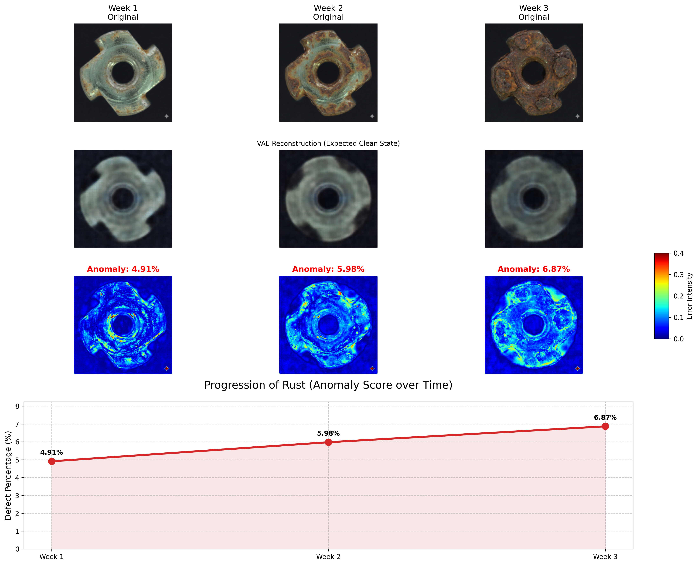

*This documentation was generated by AI  but is still an  objective explanation of the project by Me* 
# 🔍 VAE-Based Anomaly Detection for Industrial Defects

**A PyTorch implementation of a Variational Autoencoder (VAE) for unsupervised anomaly detection on metal surfaces.**

## 📌 Project Overview
This project leverages **Unsupervised Learning** to detect surface defects (rust, scratches, bent parts) in industrial components. By training a Convolutional VAE exclusively on "healthy" samples, the model learns the latent manifold of normal objects. When exposed to defective parts, the model fails to reconstruct the anomaly, creating a measurable "reconstruction error" that acts as an anomaly score.

### Key Features
* **Unsupervised Training:** The model is trained only on clean data, meaning no labeled defect examples are required during the learning phase.
* **Multi-Category Support:** Capable of learning the normal state of multiple distinct objects (Screws, Cables, Grids, etc.) simultaneously.
* **Heatmap Localization:** Generates pixel-wise error maps to pinpoint the exact location and shape of the defect.
* **Rust Progression Analysis:** A specialized time-series analysis module that tracks corrosion severity over time.

---

## 🏗️ Methodology

### 1. The Model (Convolutional VAE)
We implemented a **Convolutional Variational Autoencoder** with the following architecture:
* **Encoder:** A 4-layer CNN that compresses the input image ($224 \times 224 \times 3$) into a dense latent vector ($z=512$). It uses Batch Normalization and LeakyReLU activations to capture complex features.
* **Latent Space:** We use the Reparameterization Trick to sample $z$ from a learned distribution $\mathcal{N}(\mu, \sigma)$, ensuring the latent space is continuous and allows for smooth interpolation.
* **Decoder:** A mirrored Transposed Convolutional network that reconstructs the original image from the latent vector.

### 2. Anomaly Detection Logic
The core logic relies on the **Reconstruction Error**:
$$\text{Anomaly Score} = | \text{Input Image} - \text{Reconstructed Image} |$$

* **Normal Input:** The VAE reconstructs it perfectly (Low Error).
* **Defective Input:** The VAE tries to "fix" the defect because it has never seen one before. The difference between the broken input and the fixed output highlights the anomaly (High Error).

---

## 📊 Results & Visualization

### General Defect Detection
The model successfully differentiates between normal and anomalous samples across various categories. As seen below, the **Heatmap** (right column) lights up in red/yellow exactly where the defect is located.

* **Cable:** The model identifies the exposed wire strands.
* **Grid:** The broken metal link is clearly highlighted against the background.
* **Screw:** The rust patch on the head creates a distinct high-error region.
* **Transistor:** The misaligned/bent component is detected.

### Rust Progression Analysis
A key application of this model is monitoring material degradation. We fed sequential images of a rusting component into the model to quantify the severity of corrosion over three weeks.

**Insights:**
* **Week 1 (4.91%):** Early signs of surface oxidation are detected, with small hotspots appearing on the metal surface.
* **Week 2 (5.98%):** Corrosion spreads to the outer edges. The heatmap intensity increases, showing a clear worsening of the condition.
* **Week 3 (6.87%):** Significant structural degradation is detected. The error percentage acts as a quantifiable metric for "Health Status," allowing for automated alerts.

---

## 🚀 Possible Applications

This technology can be deployed in various industrial and maintenance settings:

1.  **Automated Quality Control (QA):**
    * Deploy on manufacturing lines to instantly reject parts with scratches, dents, or casting errors without needing human inspection.
    * *Example:* Checking screws or transistors on a conveyor belt.

2.  **Predictive Maintenance (IoT):**
    * Monitor critical infrastructure (pipelines, bridges, turbines) using cameras.
    * The model can track "Rust Scores" over months and predict when a part will fail *before* it happens, allowing for scheduled maintenance instead of emergency repairs.

3.  **Surface Inspection Drones:**
    * Drones equipped with this model can fly over solar panels or power lines.
    * The VAE can identify cracks or dirt accumulation that would reduce efficiency.

---

## 📜 License
This project is open-source and available under the MIT License.

*Data credits: MVTec Anomaly Detection Dataset*